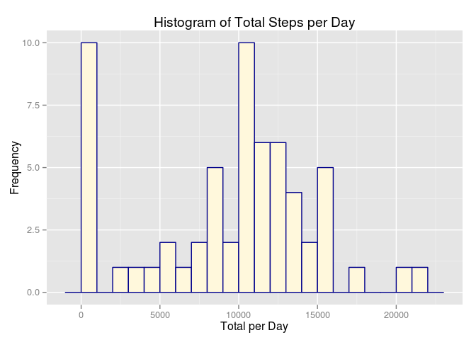
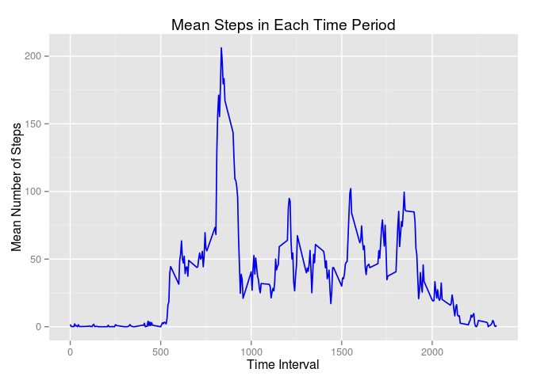
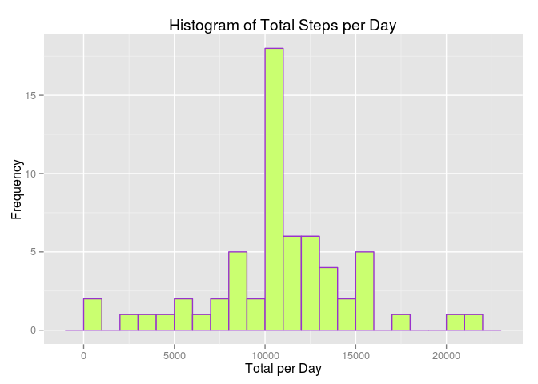
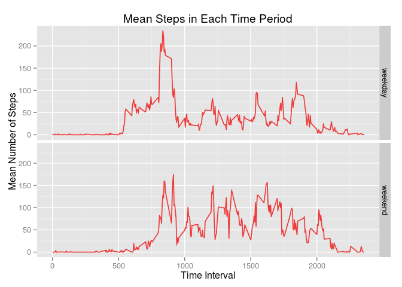

# Reproducible Research: Peer Assessment 1


## Loading and preprocessing the data
1. Load the data from the provided CSV file.   
_Assumes the CSV is in your current working directory_

```r
stepData = read.table("activity.csv",header=TRUE,sep=",")
```
2. Convert the date from a character to Date format

```r
library(dplyr)
```

```
## 
## Attaching package: 'dplyr'
## 
## The following object is masked from 'package:stats':
## 
##     filter
## 
## The following objects are masked from 'package:base':
## 
##     intersect, setdiff, setequal, union
```

```r
library(ggplot2)
stepData <- mutate(stepData,date = as.Date(date))
str(stepData)
```

```
## 'data.frame':	17568 obs. of  3 variables:
##  $ steps   : int  NA NA NA NA NA NA NA NA NA NA ...
##  $ date    : Date, format: "2012-10-01" "2012-10-01" ...
##  $ interval: int  0 5 10 15 20 25 30 35 40 45 ...
```

## What is mean total number of steps taken per day?
Group and calculate the means for each day. Create a histogram to show the frequency of number of steps recorded.

```r
byDay <- group_by(stepData,date) %>% summarize(total = sum(steps, na.rm=TRUE))
                                          
qplot(byDay$total,geom="histogram",
      binwidth=1000,
      main="Histogram of Total Steps per Day",
      xlab="Total per Day",
      ylab="Frequency",
      fill=I("cornsilk"),col=I("darkblue"))
```

 
  

The mean and median are:

```r
mean(byDay$total)
```

```
## [1] 9354.23
```

```r
median(byDay$total)
```

```
## [1] 10395
```

## What is the average daily activity pattern?
The average number of steps recorded during each time period during the day

```r
byTime <- group_by(stepData,interval) %>% summarize(avg = mean(steps,na.rm=TRUE))
gp <-ggplot(data=byTime, aes(x=interval,y=avg))
gp <- gp + geom_line(size=0.6,color="blue2") + xlab("Time Interval") + ylab("Mean Number of Steps") +
  ggtitle("Mean Steps in Each Time Period")
plot(gp)
```

 


The maximum number of average steps occurs during this time period

```r
filter(byTime,avg == max(avg))
```

```
## Source: local data frame [1 x 2]
## 
##   interval      avg
## 1      835 206.1698
```

## Inputing missing values
In the above analysis there are 2304 missing data points. 

```r
missing <- is.na(stepData$steps)
sum(missing)
```

```
## [1] 2304
```
To see the impact of this missing data, a second data set can be constructed for comparison. In this second dataset, the missing values are replaced with the average number of steps for the given time period.

```r
stepData2<-stepData
replacementValues <- sapply(stepData2[missing,3],
                               function(x) {
                                 round(
                                 select(filter(byTime,interval == x),avg))
                               })
replacementValues <- unlist(replacementValues,use.names=FALSE)
stepData2[missing,1]<-replacementValues
```
  Plotting this data in a similar manner show the change in the histogram

```r
byDay2 <- group_by(stepData2,date) %>% summarize(total = sum(steps))

qplot(byDay2$total,geom="histogram",
      binwidth=1000,
      main="Histogram of Total Steps per Day",
      xlab="Total per Day",
      ylab="Frequency",
      fill=I("darkolivegreen1"),col=I("darkorchid"))
```

 


The mean and median are altered as well

```r
mean(byDay2$total)
```

```
## [1] 10765.64
```

```r
median(byDay2$total)
```

```
## [1] 10762
```

## Are there differences in activity patterns between weekdays and weekends?
Going back to the original data set, the one with some missing values, we can compare weekend and weekday trends. First, add an additional factor column to specify weekday or weekend status.

```r
isweekday <- function(date){
  day <- weekdays(date,abbreviate=TRUE)
  day[day=="Sat"]<-"weekend"
  day[day=="Sun"]<-"weekend"
  day[day!="weekend"]<-"weekday"
  return(day)
}

stepData <- mutate(stepData,dow = as.factor(isweekday(date)))
```


Plotting the data shows the difference between weekend and weekday data

```r
byTime2 <- group_by(stepData,interval,dow) %>% summarize(avg = mean(steps,na.rm=TRUE))
gp <-ggplot(data=byTime2, aes(x=interval,y=avg)) + facet_grid(dow ~.)
gp <- gp + geom_line(size=0.6,color="brown2") + xlab("Time Interval") + ylab("Mean Number of Steps") +
  ggtitle("Mean Steps in Each Time Period")
plot(gp)
```

 


The time periods with the highest number of steps

```r
filter(byTime2, avg == max(filter(byTime2,dow == "weekend")[3]))
```

```
## Source: local data frame [1 x 3]
## Groups: interval
## 
##   interval     dow avg
## 1      915 weekend 175
```

```r
filter(byTime2, avg == max(filter(byTime2,dow == "weekday")[3]))
```

```
## Source: local data frame [1 x 3]
## Groups: interval
## 
##   interval     dow      avg
## 1      835 weekday 234.1026
```

